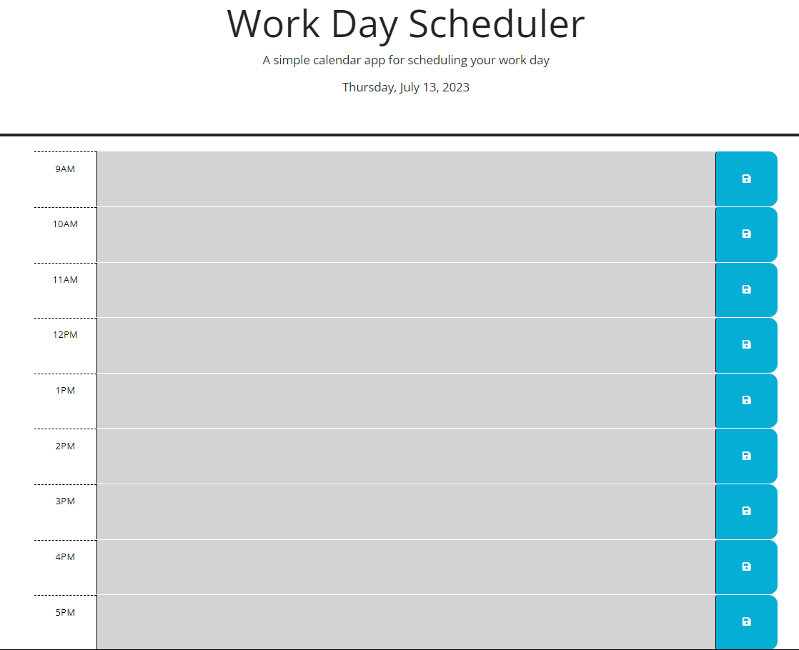

# Work Day Scheduler

A simple calendar application that allows users to schedule events for each hour of a typical working day (9am–5pm). The application features dynamically updated HTML and CSS powered by jQuery and utilizes the Day.js library to work with date and time.

## Table of Contents

- [Features](#features)
- [Installation](#installation)
- [Usage](#usage)
- [Technologies Used](#Technologies-Used)
- [Folder Structure](#folder-structure)
- [Credits](#credits)
- [Contributing](#contributing)
- [License](#license)
- [Deployed](#deployed)

## Features

- When I open the planner, the current day is displayed at the top of the calendar.
- When I scroll down, I am presented with time blocks for the standard business hours of 9am–5pm.
- When I view the time blocks for that day, each time block is color-coded to indicate whether it is in the past, present, or future.
- When I click into a time block, I can enter an event.
- When I click the save button for that time block, the text for that event is saved in local storage.
- When I refresh the page, the saved events persist.

## Installation

1. Clone the repository or download the source code.
2. Open the index.html file in a web browser.

## Usage

1. Open the `index.html` file in a web browser.
2. The current date will be displayed at the top of the calendar.
3. Scroll down to view the time blocks for the day (9am–5pm).
4. Each time block will be color-coded to indicate whether it is in the past (gray), present (red), or future (green).
5. Click into a time block to enter an event.
6. Click the save button (floppy disk icon) for that time block to save the event text in local storage.
7. Refresh the page, and the saved events will persist.

## Technologies Used

- HTML
- CSS (Bootstrap)
- JavaScript (jQuery)
- Day.js

## Folder Structure

- `index.html`: The main HTML file that displays the calendar application.
- `assets/`: The folder containing CSS, JavaScript, and other assets.
    - `css/`: Contains the CSS files.
    - `js/`: Contains the JavaScript file for the calendar application.
    - `style.css`: The CSS file that styles the calendar application.
    - `script.js`: The JavaScript file that provides the functionality for the calendar application.

## Credits

- jQuery: [https://jquery.com/](https://jquery.com/)
- Bootstrap: [https://getbootstrap.com/](https://getbootstrap.com/)
- Font Awesome: [https://fontawesome.com/](https://fontawesome.com/)
- Day.js: [https://day.js.org/](https://day.js.org/)

## Contributing

Contributions are welcome! If you encounter any issues or have suggestions for improvements,
please feel free to submit a pull request or create an issue in the repository.

## License

This project is licensed under the [MIT License](LICENSE).

## Deployed
<https://didierthomasm.github.io/Work-Day-Scheduler/>
 
